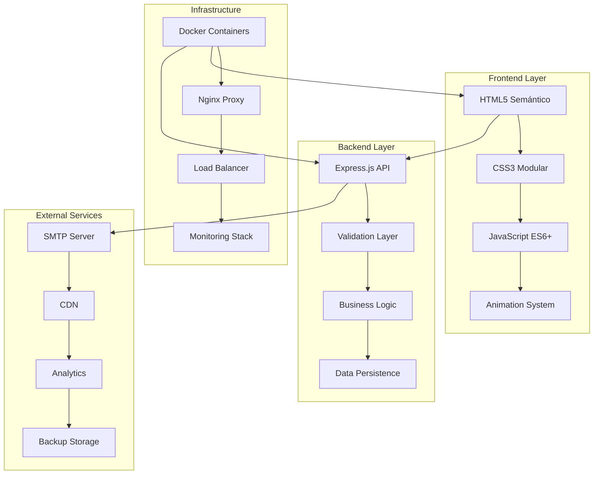

# 🚀 Portfolio Profesional - Arquitectura Full Stack

[](https://nodejs.org/)
[](https://www.docker.com/)
[](LICENSE)
[](https://tu-portfolio.com)

Un portfolio web profesional construido con arquitectura moderna, optimización de performance y mejores prácticas de desarrollo. Diseñado para desarrolladores que buscan destacar sus habilidades técnicas con una presentación excepcional.

## 📋 Tabla de Contenidos

- [✨ Características](#-características)
- [🏗️ Arquitectura](#️-arquitectura)
- [🛠️ Tecnologías](#️-tecnologías)
- [⚡ Instalación Rápida](#-instalación-rápida)
- [🔧 Configuración](#-configuración)
- [🚀 Deployment](#-deployment)
- [📖 Documentación](#-documentación)
- [🤝 Contribución](#-contribución)

## ✨ Características

### 🎨 Frontend Moderno
- **Diseño Responsive**: Mobile-first con breakpoints optimizados
- **Animaciones Fluidas**: Sistema avanzado de animaciones CSS y JavaScript
- **Performance Optimizada**: Lazy loading, code splitting, cache strategies
- **Accesibilidad**: WCAG 2.1 AA compliance, navegación por teclado
- **SEO Optimizado**: Meta tags, structured data, sitemap automático

### ⚙️ Backend Robusto
- **API RESTful**: Endpoints seguros y bien documentados
- **Validación Avanzada**: Sanitización de datos y prevención de spam
- **Rate Limiting**: Protección contra ataques DDoS y abuso
- **Sistema de Email**: Formulario de contacto con confirmación automática
- **Monitoreo**: Logs estructurados y métricas de performance

### 🔒 Seguridad Enterprise
- **Headers de Seguridad**: Helmet.js con CSP configurado
- **CORS Configurado**: Políticas de origen cruzado estrictas
- **Validación de Input**: Sanitización y validación en múltiples capas
- **Secrets Management**: Variables de entorno seguras

### 🐳 DevOps Profesional
- **Containerización**: Docker multi-stage builds optimizados
- **Orquestación**: Docker Compose con servicios completos
- **CI/CD Ready**: Configuraciones para GitHub Actions, GitLab CI
- **Monitoring**: Prometheus, Grafana, ELK Stack integrados
- **Backup Automático**: Estrategias de respaldo configurables

## 🏗️ Arquitectura



### 📁 Estructura del Proyecto

```
portfolio-web/
├── 📁 src/                          # Frontend
│   ├── 📄 index.html                # HTML principal
│   ├── 📁 css/                      # Estilos modulares
│   │   ├── styles.css               # Variables y base
│   │   ├── components.css           # Componentes
│   │   └── responsive.css           # Media queries
│   ├── 📁 js/                       # JavaScript modular
│   │   ├── main.js                  # Lógica principal
│   │   ├── projects.js              # Gestión de proyectos
│   │   └── animations.js            # Sistema de animaciones
│   └── 📁 assets/                   # Recursos estáticos
│       ├── 📁 images/               # Imágenes optimizadas
│       ├── 📁 icons/                # Iconografía
│       └── 📁 documents/            # PDFs y documentos
│
├── 📁 server/                       # Backend API
│   ├── 📄 app.js                    # Servidor principal
│   ├── 📄 package.json              # Dependencias Node.js
│   ├── 📁 routes/                   # Endpoints API
│   │   └── contact.js               # Rutas de contacto
│   ├── 📁 middleware/               # Middlewares custom
│   │   └── cors.js                  # Configuración CORS
│   ├── 📁 utils/                    # Utilidades
│   └── 📁 data/                     # Almacenamiento local
│
├── 📁 docker/                       # Configuración Docker
│   ├── 📄 Dockerfile                # Container principal
│   ├── 📄 docker-compose.yml        # Orquestación
│   ├── 📄 docker-compose.prod.yml   # Producción
│   └── 📁 nginx/                    # Configuración proxy
│
├── 📁 monitoring/                   # Stack de monitoreo
│   ├── 📄 prometheus.yml            # Métricas
│   ├── 📄 grafana/                  # Dashboards
│   └── 📄 elk/                      # Logging stack
│
├── 📁 scripts/                      # Scripts de utilidad
│   ├── 📄 deploy.sh                 # Deploy automático
│   ├── 📄 backup.sh                 # Backup database
│   └── 📄 health-check.sh           # Health monitoring
│
├── 📄 .env.example                  # Variables de entorno
├── 📄 .gitignore                    # Archivos ignorados
├── 📄 README.md                     # Documentación
└── 📄 LICENSE                       # Licencia MIT
```

## 🛠️ Tecnologías

### Frontend Stack
| Tecnología | Versión | Propósito |
|------------|---------|-----------|
| **HTML5** | Latest | Estructura semántica |
| **CSS3** | Latest | Diseño y animaciones |
| **JavaScript** | ES2022+ | Lógica e interactividad |
| **Web APIs** | Modern | Intersection Observer, etc. |

### Backend Stack
| Tecnología | Versión | Propósito |
|------------|---------|-----------|
| **Node.js** | 18+ | Runtime JavaScript |
| **Express.js** | 4.18+ | Framework web |
| **Nodemailer** | 6.9+ | Sistema de email |
| **Helmet** | 7+ | Seguridad HTTP |
| **CORS** | 2.8+ | Políticas de origen |

### DevOps & Tools
| Herramienta | Versión | Propósito |
|-------------|---------|-----------|
| **Docker** | 24+ | Containerización |
| **Docker Compose** | 2+ | Orquestación |
| **Nginx** | Alpine | Reverse proxy |
| **MongoDB** | 7+ | Base de datos |
| **Redis** | 7+ | Cache y sesiones |
| **Prometheus** | Latest | Métricas |
| **Grafana** | Latest | Visualización |

## ⚡ Instalación Rápida

### Prerrequisitos
- **Node.js** 16+ ([Descargar](https://nodejs.org/))
- **Docker** & **Docker Compose** ([Descargar](https://www.docker.com/))
- **Git** ([Descargar](https://git-scm.com/))

### 🚀 Inicio Rápido (5 minutos)

```bash
# 1. Clonar el repositorio
git clone https://github.com/tu-usuario/portfolio-web.git
cd portfolio-web

# 2. Configurar variables de entorno
cp .env.example .env
# Editar .env con tus configuraciones

# 3. Levantar con Docker (Recomendado)
docker-compose up --build

# O instalación manual
cd server
npm install
npm run dev
```

### 🌐 Acceso a la Aplicación

- **Frontend**: http://localhost:3000
- **API**: http://localhost:3000/api
- **Health Check**: http://localhost:3000/api/health
- **Grafana**: http://localhost:3001 (admin/admin123)
- **Prometheus**: http://localhost:9090

## 🔧 Configuración

### 📧 Configuración de Email

El sistema soporta múltiples proveedores SMTP:

#### Gmail
```env
SMTP_HOST=smtp.gmail.com
SMTP_PORT=587
SMTP_USER=tu.email@gmail.com
SMTP_PASS=tu-app-password  # Usar App Password
```

#### Outlook/Hotmail
```env
SMTP_HOST=smtp-mail.outlook.com
SMTP_PORT=587
SMTP_USER=tu.email@outlook.com
SMTP_PASS=tu-password
```

#### SendGrid
```env
SMTP_HOST=smtp.sendgrid.net
SMTP_USER=apikey
SMTP_PASS=tu-sendgrid-api-key
```

### 🔐 Configuración de Seguridad

```env
# Generar secrets seguros
JWT_SECRET=$(node -e "console.log(require('crypto').randomBytes(64).toString('hex'))")
SESSION_SECRET=$(openssl rand -base64 32)

# CORS Origins (separados por comas)
CORS_ORIGINS=https://tu-dominio.com,https://www.tu-dominio.com
```

### 📊 Configuración de Monitoring

```bash
# Levantar stack completo con monitoreo
docker-compose --profile monitoring --profile logging up

# Solo servicios básicos
docker-compose up api mongo nginx
```

## 🚀 Deployment

### 🌩️ Deploy en la Nube

#### Digital Ocean
```bash
# 1. Crear Droplet
doctl compute droplet create portfolio \
  --size s-2vcpu-2gb \
  --image docker-20-04 \
  --region nyc1

# 2. Configurar dominio
# 3. Deploy automático
./scripts/deploy.sh production
```

#### AWS EC2
```bash
# 1. Crear instancia EC2
aws ec2 run-instances \
  --image-id ami-0c02fb55956c7d316 \
  --instance-type t3.small \
  --key-name tu-key

# 2. Configurar Security Groups
# 3. Deploy con Docker
```

#### Vercel (Frontend only)
```bash
# Deploy frontend estático
npm install -g vercel
vercel --prod
```

### 🔄 CI/CD Automático

#### GitHub Actions
```yaml
# .github/workflows/deploy.yml
name: Deploy Portfolio
on:
  push:
    branches: [main]
jobs:
  deploy:
    runs-on: ubuntu-latest
    steps:
      - uses: actions/checkout@v3
      - name: Deploy to production
        run: |
          docker build -t portfolio .
          docker push registry/portfolio:latest
```

### 📈 Configuración de Performance

```bash
# Optimización de imágenes
npm install -g imagemin-cli
imagemin src/assets/images/* --out-dir=src/assets/images/optimized

# Audit de seguridad
npm audit
docker scan portfolio:latest

# Test de carga
artillery run load-test.yml
```

## 📖 Uso de la API

### 🔗 Endpoints Disponibles

| Método | Endpoint | Descripción |
|--------|----------|-------------|
| `GET` | `/api/health` | Health check del servidor |
| `GET` | `/api/info` | Información del sistema |
| `POST` | `/api/contact` | Enviar mensaje de contacto |
| `GET` | `/api/contacts` | Listar contactos (dev only) |

### 📝 Ejemplo de Uso

```javascript
// Enviar mensaje de contacto
const response = await fetch('/api/contact', {
  method: 'POST',
  headers: {
    'Content-Type': 'application/json',
  },
  body: JSON.stringify({
    name: 'Juan Pérez',
    email: 'juan@ejemplo.com',
    subject: 'Consulta sobre servicios',
    message: 'Hola, me interesa saber más...'
  })
});

const result = await response.json();
console.log(result);
```

### 🛡️ Rate Limiting

- **API General**: 100 requests/15min por IP
- **Contacto**: 5 mensajes/hora por IP
- **Headers**: `X-RateLimit-*` en responses

## 🧪 Testing

```bash
# Tests unitarios
npm test

# Tests de integración
npm run test:integration

# Coverage report
npm run test:coverage

# Test de carga
npm run test:load

# Security audit
npm run security:audit
```

## 📊 Monitoring y Logs

### 📈 Métricas Disponibles

- **Performance**: Response time, throughput, error rate
- **Sistema**: CPU, memoria, disco, red
- **Aplicación**: Requests por endpoint, errores HTTP
- **Business**: Contactos recibidos, conversiones

### 📋 Dashboards

1. **Sistema**: Recursos del servidor
2. **Aplicación**: Métricas de la API
3. **Negocio**: KPIs y conversiones
4. **Seguridad**: Intentos de acceso, rate limiting

### 🔍 Troubleshooting

```bash
# Ver logs en tiempo real
docker-compose logs -f api

# Conectar a container
docker exec -it portfolio-api sh

# Verificar salud de servicios
curl http://localhost:3000/api/health

# Backup de emergencia
./scripts/backup.sh emergency
```

## 🔧 Personalización

### 🎨 Personalizar Diseño

```css
/* src/css/styles.css */
:root {
  --color-primary: #tu-color-principal;
  --color-secondary: #tu-color-secundario;
  --font-family-primary: 'Tu-Fuente', sans-serif;
}
```

### 📱 Agregar Proyectos

```javascript
// src/js/projects.js
const PROJECTS_DATA = [
  {
    id: 1,
    title: "Tu Nuevo Proyecto",
    description: "Descripción del proyecto...",
    technologies: ["React", "Node.js"],
    category: "fullstack",
    // ... más configuraciones
  }
];
```

### 📧 Personalizar Emails

```javascript
// server/app.js - Función sendContactEmail
const mailOptions = {
  subject: `[Tu Portfolio] Nuevo contacto: ${data.subject}`,
  html: `
    <h2 style="color: #tu-color;">Tu Mensaje Personalizado</h2>
    <!-- Tu template HTML -->
  `
};
```

## 🚨 Troubleshooting

### Problemas Comunes

#### 🔧 Error de CORS
```bash
# Verificar configuración
echo $CORS_ORIGINS

# Agregar dominios permitidos
CORS_ORIGINS=http://localhost:3000,https://tu-dominio.com
```

#### 📧 Email no funciona
```bash
# Verificar credenciales SMTP
docker-compose exec api node -e "
const nodemailer = require('nodemailer');
// Test de conexión
"

# Logs específicos de email
docker-compose logs api | grep email
```

#### 🐳 Docker Issues
```bash
# Limpiar containers
docker-compose down -v
docker system prune -a

# Rebuild completo
docker-compose build --no-cache
```

#### 🔍 Debug Mode
```bash
# Activar debug completo
DEBUG=portfolio:* npm run dev

# Debug específico
DEBUG=portfolio:email,portfolio:api npm run dev
```

## 🤝 Contribución

### 🎯 Cómo Contribuir

1. **Fork** el repositorio
2. **Crear** branch para feature (`git checkout -b feature/nueva-funcionalidad`)
3. **Commit** cambios (`git commit -am 'Agregar nueva funcionalidad'`)
4. **Push** al branch (`git push origin feature/nueva-funcionalidad`)
5. **Crear** Pull Request

### 📋 Guidelines

- **Código**: Seguir ESLint + Prettier config
- **Commits**: Usar [Conventional Commits](https://conventionalcommits.org/)
- **Testing**: Mantener >80% coverage
- **Docs**: Actualizar README si es necesario

### 🐛 Reportar Issues

Usar los templates en `.github/ISSUE_TEMPLATE/`:
- 🐛 Bug Report
- ⭐ Feature Request
- 📚 Documentation
- 🔒 Security Issue

## 📄 Licencia

Este proyecto está bajo la Licencia MIT. Ver [LICENSE](LICENSE) para más detalles.

## 🙏 Agradecimientos

- **Comunidad Open Source** por las herramientas increíbles
- **Desarrolladores** que contribuyen con feedback
- **Diseñadores** que inspiran con sus creaciones

## 📞 Contacto

- **Website**: [tu-portfolio.com](https://tu-portfolio.com)
- **Email**: [contacto@tu-portfolio.com](mailto:contacto@tu-portfolio.com)
- **LinkedIn**: [tu-linkedin](https://linkedin.com/in/tu-perfil)
- **GitHub**: [tu-github](https://github.com/tu-usuario)

---

<div align="center">

**⭐ Si este proyecto te ayudó, dale una estrella en GitHub ⭐**

[](https://github.com/tu-usuario/portfolio-web/stargazers)

*Hecho con ❤️ y mucho ☕ por [Tu Nombre](https://tu-portfolio.com)*

</div>